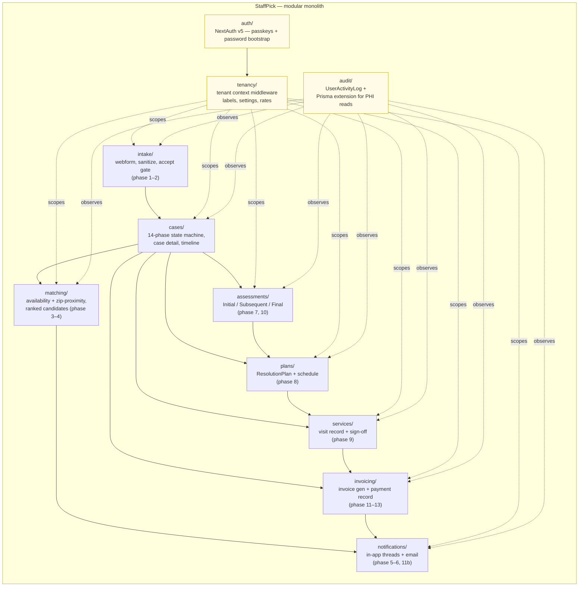

# StaffPick — Architecture

One-page Phase 0 summary. Authoritative source of intent: `docs/discovery-v0.2.md` (FCTS Platform Discovery & Architecture Baseline — v0.2, 2026-04-16).

## Locked decisions

| Area | Decision |
|---|---|
| Topology | Modular monolith. One deployable. Internal module boundaries (below). Microservices split deferred. |
| Tenancy | Single-tenant deployment for FCTS, multi-tenant data model. `tenant_id` on every domain table, indexed, not nullable. No Turso. Single Azure SQL database. Tenant context middleware enforces row-level scoping on every query. |
| Extensibility | Fixed schema + JSON `custom_properties` bag on Subject, Provider, IntakeRequest, ResolutionPlan, Assessment. Per-tenant labels in `tenant_labels`. No per-tenant schema generation. |
| Matching | Auto-rank candidate Providers by availability + zip-proximity. Mandatory Tenant Staff approval gate before assignment binds. No provider self-accept poll for MVP. |
| CliniConnect | Legacy being fully replaced. No integration surface. |
| Stack | Node 22+ LTS / TS strict, Next.js 15 App Router, Prisma 7 + `@prisma/adapter-mssql`, NextAuth v5 beta — WebAuthn passkeys (day-to-day) + email/password (bootstrap), Tailwind v4 + shadcn/ui, Resend, Azure Blob (SAS), Railway app + Azure SQL/Blob. Cron via host scheduler; Inngest deferred. Vitest + Playwright. Pino → stdout JSON. |
| Security baseline | TLS in transit; Azure SQL TDE at rest. Every API route auth + tenant scope. `UserActivityLog` records every PHI read and every mutation. Secrets via env only. No PHI in URLs / logs. Rate limiting on auth endpoints. |
| Out of MVP (stubbed or deferred) | TheraHealth EMR, real payments, native mobile, branching dynamic forms, email/API/file intake, HIPAA cert chase, external chat, EP-01007–01010. |

## Module boundaries



**Cross-cutting modules** (`auth/`, `tenancy/`, `audit/`) wrap or instrument every domain module.

**Domain modules** correspond directly to phases of the 14-phase lifecycle so the case state machine and module ownership stay aligned. Each domain module owns its Prisma models, server actions, and route handlers under `app/<module>/`.

## Folder layout (target)

```
app/
  (auth)/                NextAuth pages + handlers
  (dashboard)/           tenant-scoped UI shell
    intake/
    cases/[id]/
    providers/
    invoices/
  api/                   route handlers; webform intake; stubs (501) for email/api/file
lib/
  prisma.ts              singleton PrismaClient with @prisma/adapter-mssql
  tenant-context.ts      AsyncLocalStorage-backed tenant scope; Prisma extension
  audit.ts               UserActivityLog writer + read-event Prisma extension
  enums.ts               TS string-literal types matching Prisma comments
  matching/
  case-state-machine.ts  legal phase transitions
prisma/
  schema.prisma
  migrations/            (added in Phase 1 when DB is reachable)
  seed.ts                (Phase 1)
docs/
  discovery-v0.2.md
  architecture.md
  tech-debt.md
  mvp-gaps.md
```

## Open architecture items (revisit at phase boundaries)

- **Phase 1**: NextAuth v5 still in beta — flagged in `tech-debt.md`. Revisit if a v5 → v6 jump appears before deploy.
- **Phase 1**: Inngest vs cron — currently cron. Revisit if any phase needs durable async retries.
- **Phase 3**: `lib/matching/find-candidates.ts` scoring weights (0.6 availability / 0.4 zip-proximity) are placeholders — tune against seeded data.
- **Phase 4**: Visit signature — typed-name for MVP. Signed-link flow deferred (mvp-gaps).
- **Phase 5**: Performance pass — every list page paginates ≤25 records, dashboard queries < 500ms on seeded data.

## Deployment shape

- **App**: Railway (Jeremy's existing host). Single Next.js process. Cron via Railway scheduler.
- **DB**: Azure SQL (Ed provisions). Local dev runs Azure SQL Edge in Colima for ARM64 compatibility — same Prisma schema and migrations work against both.
- **Files**: Azure Blob with SAS-token downloads (Phase 4 onward).
- **Email**: Resend (transactional only).
- **Logs**: Pino → stdout JSON, scraped by Railway log retention. OpenTelemetry deferred.
